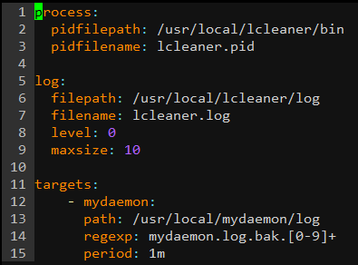

# Log Cleaner

lcleaner is short for *Log Cleaner*. This deletes the log files before the storage period you set. A daemon checks and deletes log files once a day (`fixed at midnight`)

## Installation

- Clone Repository

```bash
$ git clone https://github.com/zajann/lcleaner.git
```

- Run `install.sh`

```bash
$ cd lcleaner/scripts
$ ./install.sh
```

If a message :`# Enter the installation directory` showing up after running, Enter the **absolute path** to the directory you want to install. And DONE !

## Usage

After installation if you move `<YOUR-LCLEANER-DIR`, you can see 3 directories below.
`bin` : where binary file is located: `lcleaner` 
`etc`: where configuration file is located
`log`: where log files are located

- **Set up**

  Open the `etc/lcleaner_config.yml` and rewrite
  

  - process
    `pidfilepath`: where PID file is located
    `pidfilename`: name of PID file
  - log
    `filepath`: where log files are located
    `filename`: name of log file
    `level`: level of log (0: DEBUG, 1: INFO, 2: WARN, 3: ERROR, 4: FATAL)
  - targets
    *set up to delete `what/where/when` log files. Multiple Settings Available*
    `path`: where log files that you want to delete are located
    `regexp`: regular expression of your target log files
    `period`: storage period, you can set the period to days, months, years 
    (ex. 7d => 7 days | 6m => 6 months | 1y => 1 year)

- **Test **

  You can test if the regexp you set really match with target log files format or not before running.

  ```bash
  # example
  $ ./lcleaner -t -regexp='mydaemon.log.bak.[0-9]+' -target='mydaemon.log.bak.20200113155633'
  $ true
  ```

- **Run**

  ```bash
  $ cd <YOUR-LCLEANER-DIR>/bin
  $ ./start.sh
  ```

  If you want to stop, run `stop.sh`

## Built With

- [gocron](https://www.github.com/jasonlvhit/gocron) : used to do Cronjob
- [configor](https://www.github.com/jinzhu/configor): used to load .yml configuration file
- [process](https://www.github.com/zajann/process): used to check process running status

